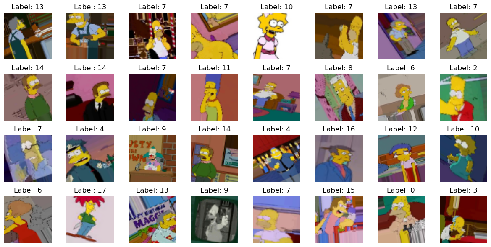

# Convolutional Neural Networks (CNN) Classification for Simpsons Characters
Author: Gregorio Mendoza Serrano
---

In this activity, we will work with Convolutional Neural Networks (CNNs) to solve an image classification problem. Specifically, we will classify images of characters from *The Simpsons*.

The dataset consists of images of characters from the show, extracted directly from episodes. This dataset has been compiled by Alexandre Attia. Among the 18 labeled characters, they appear in various poses, different positions within the image, or alongside other characters on-screen (although the character to be classified is always in the dominant position).

The dataset and additional information can be downloaded from the following link:

[The Simpsons Character Recognition Using Keras](https://medium.com/alex-attia-blog/the-simpsons-character-recognition-using-keras-d8e1796eae36)

When developing the classification using CNNs, we will study two different architectures:

1. **Model 1:** A simple CNN with 4 convolutional and pooling blocks [sequence of 32, 64, 128 and 256 filters] followed by a dense layer of 1024 neurons with a subsequent dropout of 50%, and a final layer of 18 neurons to perform the classification.
   Each of the 'convolutional blocks' is composed of the following elements:
   
      - Convolutional layer (3x3), same padding to maintain image size, and ReLU activation function.
      - Second convolutional layer (3x3) and ReLU activation function.
      - Max pooling layer that reduces the spatial dimensions (width and height) of the image by half.
      - Dropout layer that randomly turns off 30% of the units during training to prevent overfitting.

2. **Model 2:** A simplified Xception-type CNN, with 2 blocks of depthwise separable convolutions, iterated with a sequence of [32, 64, 128, 128, 256] filters, which separates spatial and channel convolutions, and then three dense convolutional layers: one of 1024 and another of 256 neurons, both with a dropout of 50%, and a final layer of 18 neurons to perform the classification.
   The choice of this model is based on its effectiveness in detecting details in image borders and edges (which is the case of our dataset, since the images are very well defined).
